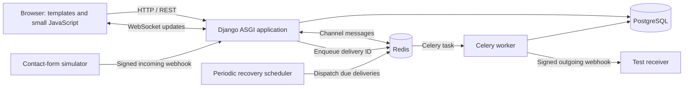
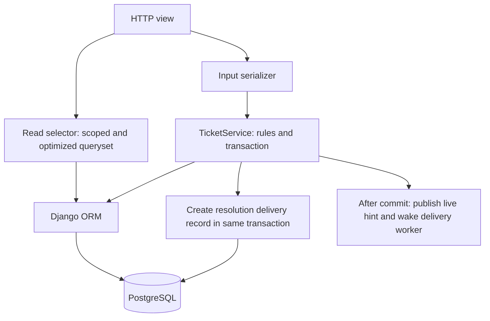

# Mini Helpdesk — Architecture

Status: proposed learning-project design, not an implemented application.

Read next: [System design](SYSTEM_DESIGN.md) for contracts and flows; [Project structure](PROJECT_STRUCTURE.md) for folders and the build sequence.

## 1. Purpose and scope

Build a small support-ticket system to practise Django backend engineering through realistic problems. A customer creates a ticket, an agent claims it, and both add comments. The customer sees changes immediately. An external contact form can create tickets through a signed webhook, and resolving a ticket sends an outgoing webhook.

The finished learning scope is one support team, two roles, three ticket states, one incoming integration, and one configured outgoing receiver. Use three simple pages: login, ticket list, and ticket detail. Django admin handles account and tag setup.

Exclude organizations, billing, attachments, separate chat rooms, public registration, reassignment, ticket deletion, and reopening resolved tickets. These can be separate exercises after the core project works.

## 2. Architecture choice

Use a **modular monolith**: one Django repository, one PostgreSQL database, and explicit module boundaries. HTTP and WebSocket traffic enter the same ASGI application. A background worker runs the same application code in a separate process when webhook delivery is introduced.



Redis supports two separate uses: a Channels channel layer and a Celery broker. Give them separate keys/configuration namespaces. PostgreSQL remains the source of truth; Redis messages are not the permanent ticket history.

## 3. Technology choices

| Component | Choice | Purpose |
| --- | --- | --- |
| Application | Django | Models, migrations, sessions, admin, templates |
| API | Django REST Framework | Validation, permissions, pagination, response formats |
| Database | PostgreSQL | Constraints, row locking, aggregation, query plans |
| Live updates | Django Channels + channels_redis | Authenticated ticket subscriptions and event fan-out |
| Background jobs | Celery + Redis | Outgoing HTTP delivery outside user requests |
| Frontend | Django templates + small JavaScript files | Three pages without a separate frontend framework |
| Tests | pytest + pytest-django; Channels test utilities | Workflows, permissions, concurrency, live updates |
| Local infrastructure | Docker Compose | Repeatable application, database, broker, and worker setup |

Choose mutually compatible stable package versions when implementing and lock the resolved dependencies. These documents specify behavior rather than claiming a particular version matrix has been tested. On Windows, run the Linux containers for the worker and infrastructure.

Channels supports communication between application instances through a channel layer; its Redis backend is appropriate for this design. [Channels documentation](https://channels.readthedocs.io/en/stable/topics/channel_layers.html)

## 4. Module ownership

| Module | Owns | Boundary |
| --- | --- | --- |
| `accounts` | Custom user, customer/agent role, login/logout | Does not own ticket workflows |
| `tickets` | Tickets, comments, tags, visibility, state transitions, query optimization | Owns all ticket mutations |
| `integrations` | Signature verification, incoming-event deduplication, outgoing delivery records and retries | HTTP delivery never runs inside a ticket transaction |
| `realtime` | WebSocket consumers, group subscription, channel-layer publishing | Broadcasts committed changes; does not mutate tickets |
| `config` | Settings, routes, ASGI, Celery setup, dependency wiring | Composes modules; contains no business rules |

`realtime` can be a Python package without database models. Keep shared code small: no generic repository framework or universal base-service hierarchy.

## 5. Internal request flow



- **Views** handle HTTP, authentication, request validation, and mapping domain errors to responses.
- **Services** own business actions and their transaction boundaries. They check authorization even when invoked outside HTTP.
- **Selectors** provide reusable, permission-scoped read queries with explicit joins, prefetches, annotations, and ordering.
- **Models** define persisted data and constraints. Serializers do not quietly run extra reads for each result row.
- **Adapters** perform transport-specific work such as publishing to Channels or sending an HTTP webhook.

Keep writes synchronous initially. A synchronous `JsonWebsocketConsumer` is sufficient for the small subscription-only WebSocket. A synchronous publisher can bridge to the asynchronous channel-layer API using `async_to_sync`. This avoids introducing asynchronous database access before it is needed.

## 6. Applying SOLID without excess abstraction

Use one deliberately small interface initially:

```python
class EventPublisher(Protocol):
    def publish(self, *, group: str, event: dict) -> None:
        ...
```

Its contract is to attempt publication of a committed event. It does not promise durable delivery to a browser. A Channels adapter and a recording test fake implement the same input contract and documented `PublishError` failure behavior. `TicketService` receives the publisher through its constructor; `config/wiring.py` constructs the concrete service.

| Principle | Concrete application |
| --- | --- |
| Single responsibility | Separate ticket workflows, incoming signature checks, and outgoing HTTP delivery. |
| Open/closed | Add a logging publisher by implementing the existing contract; ticket methods remain unchanged. |
| Liskov substitution | Run shared contract tests against adapters/fakes; none requires extra caller steps or promises stronger delivery guarantees. |
| Interface segregation | `EventPublisher` only publishes; it does not also expose subscription management or webhook retry administration. |
| Dependency inversion | Ticket workflows depend on the publisher contract, with the concrete Channels adapter supplied by wiring. |

Keep Django ORM usage direct in services and selectors. A repository abstraction would add work without helping the initial learning goal.

For the small cross-module dependency, ticket resolution calls an explicit `integrations.services.outgoing.record_resolution_delivery(...)` function with primitive values. This helper only inserts a delivery row using the caller's transaction. It does not import ticket services or make network requests. The incoming webhook handler receives the ticket service from its view, avoiding circular service imports.

## 7. Consistency and delivery guarantees

- Ticket/comment writes are transactional and authoritative in PostgreSQL.
- Every ticket mutation increments a version while holding the ticket lock. That version identifies the latest ticket state for clients.
- Publish live hints only after the database commit. Django's `on_commit()` supports this ordering. A callback failing cannot undo the committed write; callbacks must catch and log expected transport failures. [Django transactions](https://docs.djangoproject.com/en/5.2/topics/db/transactions/)
- WebSocket updates are best effort. Clients refetch on reconnect and when a live hint arrives; no durable socket replay is required.
- Incoming webhook deduplication uses a database uniqueness constraint plus a transaction, so retries do not create multiple tickets.
- When the outgoing integration is enabled, resolving a ticket creates a delivery row in the same transaction. The row acts as a small transactional outbox for this one event type.
- `on_commit()` wakes the worker for low latency. A periodic database scan recovers pending deliveries if queuing fails after the commit.
- Outgoing webhooks use bounded retries and can arrive more than once. Receivers must deduplicate by event ID. Successful delivery is not guaranteed if all attempts fail.

## 8. Incremental deployment

1. **Core:** web process and PostgreSQL. Build auth, ticket actions, permissions, pagination, and database exercises.
2. **Live updates:** add Redis and Channels. Use a no-op publisher before this phase.
3. **Incoming integration:** add a signed contact-form simulator and deduplication; incoming processing remains synchronous and small.
4. **Outgoing integration:** add Celery worker, delivery records, and periodic recovery. Enable outgoing integration only after all parts are present.

In the completed local setup, run one web container, PostgreSQL, Redis, one worker, and one scheduler. The webhook simulator/receiver is a development utility, not a microservice architecture.

## 9. Limits and later exercises

There is no high-availability target or throughput promise. Use a local learning fixture of about 1,000 tickets and 10,000 comments to expose query behavior, then measure performance on your machine.

Later exercises can include cache invalidation for a queue summary, email notifications, request throttling, cursor pagination, structured audit history, and production deployment. Add them one at a time after the acceptance checks in the system design pass.
