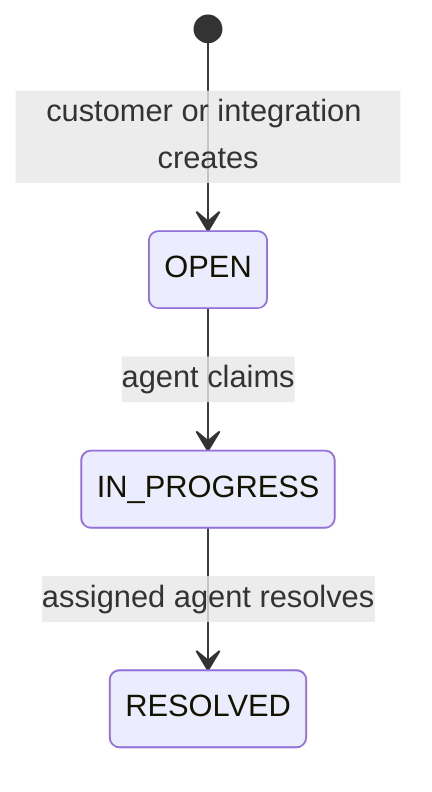
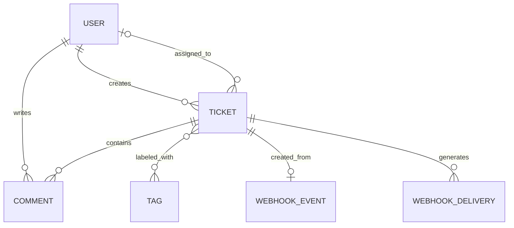

# Mini Helpdesk — System Design

Status: proposed contracts and acceptance criteria. Nothing in this document is a claim that the application or tests already exist.

Related documents: [Architecture](ARCHITECTURE.md) · [Project structure](PROJECT_STRUCTURE.md).

## 1. Actors and business rules

| Actor | Allowed actions |
| --- | --- |
| Customer | Create a ticket, list/view own tickets, comment on own unresolved tickets, subscribe to own ticket updates |
| Agent | List/view all tickets, claim an open ticket, comment on unresolved tickets, resolve a ticket assigned to themselves |
| Contact-form integration | Create a ticket for its configured demo customer using a signed event |
| Administrator | Provision users, roles, tags, and inspect records through Django admin |

Provision accounts with a management command/admin. A new user defaults to customer; ordinary users cannot change roles. The integration's customer is configured server-side: a payload cannot choose an arbitrary user ID or grant ownership using an email address.

Do not expose ticket owner, assignee, status, or version through a generic writable serializer. Use named actions and service methods. Keep ticket owner and user roles fixed during the first version; role changes by an administrator require active sockets to be disconnected before further access.

### State machine



- New tickets are `OPEN`, unassigned, at version 1.
- Claiming assigns the actor and changes status to `IN_PROGRESS` atomically.
- A repeated claim by the same assigned agent succeeds without another mutation; another agent gets `409 Conflict`.
- Only the assigned agent can resolve. A repeated resolve by that agent returns the current state without generating a second event.
- Comments are append-only and permitted while `OPEN` or `IN_PROGRESS`.
- Customers cannot set status or assignment. Resolved tickets are read-only.
- Tags are managed through admin in the initial version; no public tag-mutation API is required.

## 2. Data model

Use UUID primary keys for tickets, comments, incoming-event records, and delivery records. Keep Django's normal user key. All timestamps are timezone-aware and API timestamps use UTC ISO 8601.

| Model | Important fields |
| --- | --- |
| `User` | Django `AbstractUser` fields; `role` = CUSTOMER or AGENT |
| `Ticket` | `id`, `customer_id`, nullable `assignee_id`, `title` (200 chars), `description` (10,000 chars), `status`, `version`, `created_at`, `updated_at`, nullable `resolved_at` |
| `Comment` | `id`, `ticket_id`, `author_id`, `body` (5,000 chars), `created_at` |
| `Tag` | `id`, unique `name`; many-to-many relation to Ticket |
| `WebhookEvent` | `id`, `source`, `external_event_id`, `payload_sha256`, `ticket_id`, `received_at` |
| `WebhookDelivery` | `id` (also outgoing event ID), `ticket_id`, `event_type`, `ticket_version`, `destination_key`, immutable `body_text`, `status`, `attempt_count`, `next_attempt_at`, nullable `lease_token`, nullable `lease_until`, nullable `last_http_status`, `last_error`, `created_at`, nullable `delivered_at` |

`WebhookEvent` represents an incoming event successfully applied in the same transaction as its ticket. Invalid requests are not persisted as processed events. `WebhookDelivery` is the durable pending outgoing event plus its current delivery state; a separate event bus or attempt-history table is unnecessary initially.



### Constraints and indexes

- Enforce valid role/status values with database check constraints, in addition to application choices.
- Ticket check: `OPEN` requires no assignee; `IN_PROGRESS` and `RESOLVED` require one.
- Ticket check: `resolved_at` is present exactly when status is `RESOLVED`; version must be positive.
- Unique incoming key: `(source, external_event_id)`; the source is determined by the authenticated endpoint/configuration.
- Make `WebhookEvent.ticket` a one-to-one relationship for the initial one-event/one-ticket integration.
- Unique outgoing business event: `(ticket_id, event_type, ticket_version, destination_key)`.
- Ticket indexes: `(customer_id, created_at, id)`, `(status, created_at, id)`, and `(assignee_id, status, created_at, id)`.
- Comment index: `(ticket_id, created_at, id)`.
- Delivery indexes: `(status, next_attempt_at)` and `(status, lease_until)` for pending/retry and expired-lease scans.
- Foreign keys to users use `PROTECT`; disable users instead of deleting them. Ticket deletion is unavailable; protect tickets referenced by integration records.

Cross-table rules, such as an assignee having the AGENT role, are enforced in services. Use PostgreSQL for locking tests and inspect query plans before adding more indexes.

## 3. HTTP API

Base path: `/api/v1/`. Use session authentication on the same origin and CSRF protection for browser writes. Login uses Django's normal CSRF-protected login form.

| Method and path | Purpose | Success |
| --- | --- | --- |
| `GET /auth/me/` | Current user and role | 200 |
| `POST /auth/logout/` | End session | 204 |
| `GET /tickets/` | Visible tickets, filters, pagination | 200 |
| `POST /tickets/` | Customer creates ticket | 201 |
| `GET /tickets/{id}/` | Visible ticket detail | 200 |
| `POST /tickets/{id}/claim/` | Agent claims ticket | 200 |
| `POST /tickets/{id}/resolve/` | Assigned agent resolves | 200 |
| `GET /tickets/{id}/comments/` | Visible ticket's paginated comments | 200 |
| `POST /tickets/{id}/comments/` | Add a comment | 201 |
| `POST /webhooks/contact-form/` | Signed integration event | 201 first application; 200 duplicate |

Use page-number pagination: default 20, maximum 100. Ticket ordering is `-created_at, -id`; comment ordering is `created_at, id`. Ticket filters: `status`, `assignee=me` (agents only), and bounded title search `q`. Always scope by visibility before applying filters. A ticket the caller cannot see returns `404`.

Payload examples:

```json
{"title": "Unable to reset password", "description": "The reset link has expired."}
```

```json
{"body": "Please try the replacement link."}
```

Ticket list items include `id`, `title`, `status`, `version`, minimal customer/assignee objects (`id`, `username`), tag names, `comment_count`, and timestamps. Do not include full comment histories or email addresses in every list row. Detail and comment reads enforce the same visibility rules.

Error contract for API failures:

```json
{"error": {"code": "ticket_already_claimed", "message": "Another agent has claimed this ticket.", "fields": {}}}
```

Use `400` for malformed/invalid input, `403` for session authentication/permission failures, `404` for invisible/missing resources, and `409` for state conflicts. DRF session authentication can return `403` for unauthenticated API requests; tests should follow this documented project choice rather than expecting `401` universally. Configure an API exception handler to normalize validation and permission errors; HTML login errors remain form responses.

## 4. WebSocket contract

Endpoint: `/ws/tickets/{ticket_id}/`.

Use session authentication middleware plus an origin validator. Before joining group `ticket.<uuid>`, confirm the user is active and can view the ticket. Reject unauthorized connections. Use a synchronous consumer initially; recheck active-user and ticket access before forwarding each event. No ticket content is accepted as a WebSocket command: all writes use HTTP service paths.

Example browser message:

```json
{
  "event_id": "c9bc07c4-8369-420c-a12f-a7e41ad1f9de",
  "type": "ticket.changed",
  "ticket_id": "2145ab7a-6f12-4443-a41a-9046590ee52d",
  "version": 4,
  "reason": "comment.created",
  "occurred_at": "2026-10-02T10:30:00Z"
}
```

Reasons are `ticket.claimed`, `comment.created`, and `ticket.resolved`. This is a change hint: the browser refetches the detail and, where relevant, comments through HTTP. Group-layer messages use a distinct internal dispatch type such as `ticket.event`; the consumer translates them to the browser schema above.

Client behavior:

1. Connect, then fetch the current ticket snapshot, buffering hints while the fetch is in flight.
2. Keep the highest observed ticket version; ignore older/duplicate hints.
3. On a newer version, refetch. Discard stale HTTP responses and refetch again if a buffered hint is newer than the returned snapshot.
4. Reconnect with capped exponential backoff, then repeat the snapshot fetch.
5. Refetch when the tab regains focus and periodically, such as every 30 seconds while visible, to recover a missed hint without a disconnect.

The socket has no guaranteed replay or ordering across publishers. Close it on browser logout; long-lived session revocation is a separate hardening exercise. Never treat socket access as permission to perform a later HTTP mutation.

## 5. Transaction and race-condition flows

### Claim a ticket

Inside `transaction.atomic()`, fetch the visible ticket using `select_for_update()`, verify the actor is an agent, and check current assignment/status. Assign once and increment the version. Register the live hint after commit. Two competing requests must result in one winner and one conflict, not a silent reassignment.

### Add a comment

Lock the parent ticket before checking access and unresolved status. Create the comment, increment ticket version, and update `updated_at` in the same transaction. This serializes comment creation against resolution: a comment either commits before resolution or is rejected afterward.

### Resolve a ticket

```mermaid
sequenceDiagram
    participant Agent
    participant API
    participant DB as PostgreSQL
    participant Queue as Redis / Celery
    participant Worker
    participant Receiver
    Agent->>API: POST resolve
    API->>DB: BEGIN; lock and authorize ticket
    API->>DB: Update status/version; insert delivery snapshot
    API->>DB: COMMIT
    API->>Queue: Best-effort task enqueue and live hint
    API-->>Agent: 200 resolved ticket
    Queue->>Worker: Deliver delivery ID
    Worker->>DB: Claim due delivery lease
    Worker->>Receiver: Signed POST outside transaction
    Receiver-->>Worker: 2xx acknowledgement
    Worker->>DB: Mark delivered if lease still owned
```

All mutations for an existing ticket acquire the ticket lock first. Keep network I/O outside locks. If outgoing integration is disabled, resolution skips creating a delivery; enabling it later does not backfill earlier resolutions.

## 6. Incoming webhook

The contact-form simulator sends this body:

```json
{
  "event_id": "form-submission-001",
  "type": "contact.submitted",
  "data": {"title": "Cannot sign in", "description": "Please help me regain access."}
}
```

Headers: `X-Webhook-Timestamp` (Unix seconds) and `X-Webhook-Signature` (`sha256=<hex>`). Sign the bytes `timestamp + "." + raw_request_body` with HMAC-SHA256 and the configured incoming secret. Verify with a constant-time comparison before parsing or applying the event. Reject timestamps more than five minutes in either direction. The simulator uses a fresh timestamp/signature on retry, retaining the same event ID and exact body bytes.

Processing contract:

1. Apply a small request-body limit, such as 64 KiB. Validate timestamp/signature; signature failures return `401`.
2. Validate the event type and schema; compute SHA-256 of the raw body.
3. In one transaction, create the ticket through the shared ticket service for the configured customer and insert `WebhookEvent` with its unique `(source, external_event_id)` key.
4. If the unique key collides, allow that transaction to roll back, then read the existing event outside the failed transaction. Matching payload hash returns `200` and its existing ticket ID; a different hash returns `409 event_payload_conflict`.
5. First success returns `201` and the new ticket ID. Failed processing leaves neither a ticket nor a processed-event row.

Concurrent duplicate requests may briefly construct competing tickets inside their transactions; the losing transaction rolls its ticket back. Unrelated integrity errors are not treated as duplicates. Avoid external side effects during creation; any future callbacks must run only after a successful commit.

Only this machine-to-machine endpoint is exempt from CSRF. It does not accept a browser session as a substitute for a valid signature. Store secrets in environment configuration and never log them.

## 7. Outgoing webhook and recovery

Use one configured receiver named `demo_receiver`, with a fixed URL and separate outgoing signing secret. Users cannot submit delivery URLs. Development allows the known local receiver address; deployments should configure HTTPS destinations explicitly and disable redirects.

The immutable `body_text` is serialized once when resolution commits:

```json
{
  "event_id": "f8bacacf-5583-44f4-9513-aad2b479de39",
  "type": "ticket.resolved",
  "occurred_at": "2026-10-02T10:35:00Z",
  "data": {
    "ticket_id": "2145ab7a-6f12-4443-a41a-9046590ee52d",
    "status": "RESOLVED",
    "version": 5
  }
}
```

Use the same signing format as incoming events, with a fresh delivery timestamp per attempt and the stored body bytes. Preserve the event ID and business-event timestamp on every retry. The receiver atomically stores event IDs with its effects and acknowledges duplicates with `2xx`.

Delivery states: `PENDING`, `IN_FLIGHT`, `RETRY`, `DELIVERED`, `FAILED`.

- Worker tasks receive a delivery ID, not live ORM objects.
- Claim the row in a short transaction; check due time and terminal state, set a fresh lease token, set a 60-second lease, and increment `attempt_count`.
- Send outside the transaction with explicit connection/read timeouts and a total task deadline shorter than the lease. Update results only if the same lease token still owns the row.
- Treat any `2xx` as success. Retry network/timeouts, `408`, `429`, and `5xx`; other `4xx` and redirects are permanent failures. Bound and honor `Retry-After` where valid.
- Use five automatic attempts total: first immediately, then approximately 10 seconds, 30 seconds, 2 minutes, and 10 minutes after failures, with jitter. Exhaustion sets `FAILED`.
- A scheduler every 30 seconds enqueues due `PENDING`/`RETRY` rows and expired `IN_FLIGHT` leases. Duplicate enqueues are safe because workers must claim the row before sending. Expired leases consume their already-counted attempt; exhausted rows become `FAILED`.
- An admin-only management command may reset a failed delivery for a new retry cycle, preserving its event ID/body and logging the operator action.

The database record controls retries; do not also configure a competing independent Celery autoretry loop. Celery task execution may repeat, so tasks must tolerate repeated execution. [Celery task guidance](https://docs.celeryq.dev/en/stable/userguide/tasks.html)

A receiver may accept a request before the worker crashes without saving success. The subsequent retry can therefore duplicate delivery even with a lease. The design provides bounded at-least-once delivery attempts, not exactly-once effects across two systems.

## 8. N+1 query exercise

Seed 1,000 tickets with different customers/assignees, several tags, and about 10,000 comments.

First observe a naive list serializer that accesses `ticket.customer`, `ticket.assignee`, `ticket.tags.all()`, and `ticket.comments.count()` for every row. Query count increases with the page size.

Optimize the shared list selector with:

- `select_related("customer", "assignee")` for single-valued relationships.
- `prefetch_related("tags")` for the many-to-many relationship.
- `annotate(comment_count=Count("comments"))` for counts without fetching comment bodies.

Ensure the serializer uses prefetched tags and the annotation; a new filtered related-manager query can bypass the cache. DRF documents eager-loading related data to prevent list-serialization N+1 queries. [DRF optimization guidance](https://www.django-rest-framework.org/api-guide/generic-views/#avoiding-n1-queries)

With just this selector and schema, expect two data queries: ticket rows with joins/counts, then tags. Page-number pagination adds a count query; authentication and permission reads must be measured separately. Assert that rendering a populated 20-row page and a 100-row page uses the same data-query count. Record the measured baseline rather than hardcoding an unverified total-request count.

Also inspect the PostgreSQL plan for customer/status filters. An index and a bounded query count do not by themselves guarantee a fast query.

## 9. Observability and acceptance checks

Log request ID, action, ticket ID, version, event/delivery ID, attempt number, duration, and outcome. Avoid comment text, descriptions, raw payloads, session cookies, and signing secrets. Inspect failed deliveries through read-only admin fields and use the explicit retry command for recovery.

| Exercise | Passing condition |
| --- | --- |
| HTTP permissions | Customer A cannot list, view, comment on, or subscribe to customer B's ticket. |
| Claim race | Two agents using separate PostgreSQL connections attempt a claim; exactly one owns the ticket. |
| Comment/resolve race | Comment commits before resolution or is rejected after it; no comment is accepted on a resolved ticket. |
| Incoming duplicate | Sequential and concurrent identical events create exactly one ticket. |
| Payload conflict | Same source/event ID with different signed bytes returns 409 and creates no additional ticket. |
| Signature validation | Invalid, stale, future-dated, and malformed signatures are rejected. |
| Transaction rollback | Failed resolution leaves status/version and delivery records unchanged and publishes no hint. |
| Database optimization | Serializing more tickets does not add per-ticket related-object queries. |
| WebSocket access | Anonymous/invisible ticket connections are rejected; valid subscribers receive committed change hints. |
| Reconnect | Disconnected browser refetches and reaches the latest state without socket replay. |
| Queue outage | Resolution commits with a pending delivery; recovery dispatches it after the broker returns. |
| Worker crash | Lease expiry makes a delivery eligible again; duplicate acceptance has one receiver-side effect. |
| Retry policy | Transient failures are retried; permanent failures and exhausted attempts become FAILED. |

Use real PostgreSQL transaction tests for locking. Test commit callbacks explicitly rather than relying on tests that silently roll back every transaction. Test retry decisions using injected clocks/HTTP clients, then run a small real-worker integration scenario for the broker recovery path. No test results are implied by this design document.
